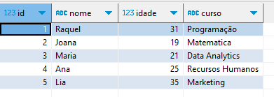
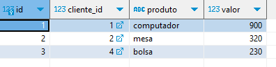

# Bootcamp Data Analytics - WOMAKERS  

# Exercícios Banco de Dados -  SQL

## Tecnologias Utilizadas:
- SQLite
- DB Browser for SQLite
- Visual Studio Code

## Perguntas e Respostas:

1. **Qual é o propósito deste repositório?**
   - Este repositório contém uma série de exercícios práticos de banco de dados, focados em SQL e operações de banco de dados relacionais.

2. **Quantas tabelas foram criadas e quais são os seus nomes?**
   - Foram criadas três tabelas: "alunos", "clientes" e "compras".

3. **Quais são os campos da tabela "alunos"?**
   - Os campos da tabela "alunos" são: id (inteiro), nome (texto), idade (inteiro) e curso (texto).

4. **Quantos registros de alunos foram inseridos na tabela "alunos"?**
   - Foram inseridos pelo menos 5 registros de alunos na tabela "alunos".

5. **Quais são as consultas básicas realizadas neste repositório?**
   - As consultas básicas incluem: seleção de todos os registros da tabela "alunos", seleção do nome e idade dos alunos com mais de 20 anos, seleção dos alunos do curso de "Engenharia" em ordem alfabética e contagem do número total de alunos na tabela.

6. **Quais operações de atualização e remoção foram realizadas nas tabelas?**
   - Foram realizadas operações de atualização e remoção de dados na tabela "alunos", incluindo a atualização da idade de um aluno específico e a remoção de um aluno pelo seu ID.

7. **Quais consultas e funções agregadas foram utilizadas nos dados da tabela "clientes"?**
   - As consultas e funções agregadas incluem: seleção do nome e idade dos clientes com idade superior a 30 anos, cálculo do saldo médio dos clientes, identificação do cliente com o saldo máximo e contagem de quantos clientes têm saldo acima de 1000.

8. **Qual é o propósito da tabela "compras" e como ela está relacionada com a tabela "clientes"?**
   - A tabela "compras" armazena informações sobre as compras feitas pelos clientes. Ela está relacionada com a tabela "clientes" através da chave estrangeira "cliente_id", que referencia o ID do cliente na tabela "clientes".

## Print do Banco de Dados:

Print dos resultados finais nas tabelas abaixo:

